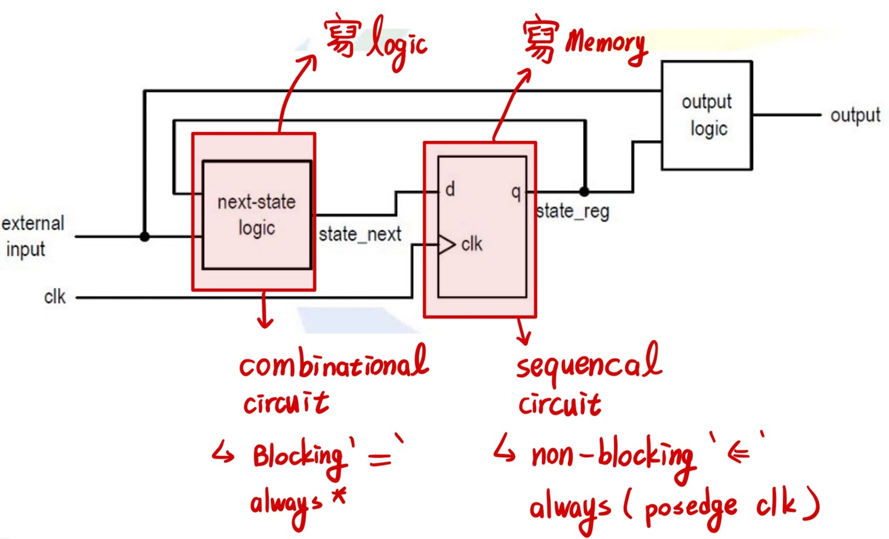

# Sequential Circuit

- Sequential Circuit具有 **記憶功能**，能保存內部狀態。
- 輸出為 **輸入與內部狀態的函數**。
- 不同於組合電路（僅依賴輸入）。
- 設計多採用 **同步設計方法**（Synchronous Design Methodology）。

---

# 同步設計與 D 型正反器 (D Flip-Flop)

- 所有儲存元件由 **全域時鐘（Global Clock）** 控制。
- 資料在 **時鐘上升緣或下降緣** 被採樣與儲存。
- DFF 是最基本的儲存元件。

## DFF 三個主要時序參數：

- **Clock-to-Q Delay (Tcq)**：時鐘上升緣後，d 傳到 q 的延遲時間。
- **Setup Time (Tsu)**：d 在時鐘邊緣前須穩定維持的時間。
- **Hold Time (Thold)**：d 在時鐘邊緣後須穩定維持的時間。
- 多個 DFF 可組成 **暫存器（Register）**。

---

# Next-State Logic

## 定義與角色：

- 將系統中的 **記憶元件與邏輯運算部分分離**。
- 剩下的部分是 **純組合邏輯（Combinational Logic）**。
- 根據輸入與目前狀態，計算下一個狀態值。

## Sequential Circuit的分類：

1. **常規序向電路（Regular Sequential Circuit）**
2. **有限狀態機（Finite State Machine, FSM）**
3. **具資料路徑的 FSM（FSM with Data Path, FSMD）**

---

# HDL 中的 Next-State Logic 實作方式

## Memory 元件實作：

- 使用區塊：`always @(posedge clk or posedge reset)`
- 採用 **非阻塞賦值（<=）**，確保所有暫存器（例如 DFF ）能在同一個時鐘邊緣「同時」更新，避免時間競賽（Race Condition）。
- 表示記憶元件在時鐘邊緣或復位時更新。
- 有關**記憶邏輯**的都是在non-blocking中實現

## Next-State Logic 實作：

- 使用區塊：`always @*`（表示組合邏輯）
- 採用 **阻塞賦值（=）**
- 表示根據輸入與狀態即時計算下一狀態值。
- 有關**組合邏輯**的都在blocking中實現
