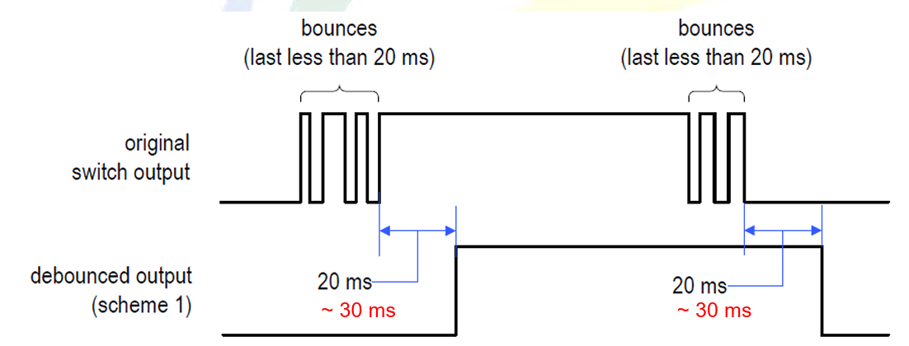

# 有限狀態機（Finite-State Machine, FSM）概述

## 基本定義
- FSM 是用來模型化具有**有限數量內部狀態**的系統。
- 狀態轉換依賴於：
  - 當前狀態（state），說明現在的狀態
  - 外部輸入（input），說明如果 A->B 之間的條件輸入
- FSM 的次態邏輯通常是「從零建構」的組合邏輯，稱為 **隨機邏輯（random logic）**。

---

## 表示方式

### ▸ 狀態圖（State Diagram）
- 由**節點（表示狀態）**與**轉換弧（表示狀態變化）**構成。
- 適用於簡單應用，易於視覺化。

### ▸ ASM 圖表（Algorithmic State Machine）
- 結構更清晰，適用於複雜 FSM。
- 組成單元：
  - **狀態方塊（State Box）**
  - **決策方塊（Decision Box）**（可選）
  - **條件輸出方塊（Conditional Output Box）**（可選）

左側是 ASM ，右側是 State Diagram

---

## FSM 的程式碼設計流程

典型 FSM 的程式碼包含以下結構：

### ▸ 狀態定義
- 使用 **符號狀態（symbolic states）**，如：`s0`, `s1`, `s2`...

### ▸ 訊號宣告
- 包含：
  - `state_reg`：目前狀態
  - `state_next`：下一個狀態

### ▸ State Register ， 當前狀態紀錄
- 使用非阻塞賦值 `<=`  
- 由 `always @(posedge clk or posedge reset)` 控制  
- 根據時鐘或 reset 更新 `state_reg`

### ▸ Next-State Logic ， 當input進來時
- 使用阻塞賦值 `=`
- 放在 `always @*` 區塊中
- 根據 `state_reg` 和輸入訊號決定 `state_next`

### ▸ 輸出邏輯（Output Logic）
- 兩種型態：
  - **Moore 型 FSM**：輸出的結果只看於目前狀態（`state_reg`）
  - **Mealy 型 FSM**：輸出依賴看狀態+輸入（`state_reg` + input）

---

## 舉個例子

- 此為 State Diagram，Moore型FSM
- 此舉例是經典的Debounce判斷FSM
  - `SW`代表按鈕是否按下的狀態，如果按下為True，否為False
  - `m_tick`代表一個時脈，此時脈抓10ms一次，所以SW需要保持相同狀態20-30ms才會轉換結果(0->1或是1->0)
  - 而圓圈所代表的是state，**output結果只看state (Moore)**，只要state是zero、 wait1_1、wait1_2、wait1_3，output的都是0；如果是one、wait0_1、wait0_2、wait0_3，output都是1。

