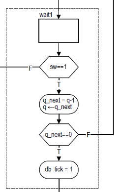
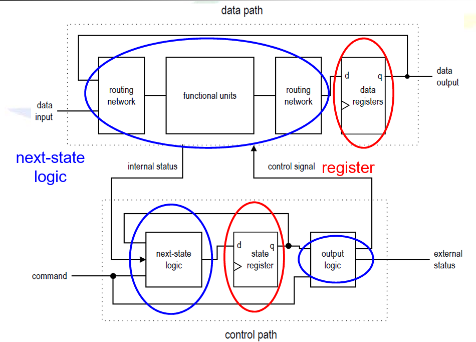

# FSMD（有限狀態機與資料路徑）觀念整理

## FSMD 定義與組成

- **FSMD**（Finite-State Machine with Data Path）是結合：
  - **FSM** → 控制邏輯（Control Path）
  - **常規序列電路**（如暫存器、加法器等）→ 資料處理（Data Path）

- 用途：實現**暫存器傳輸級（RT-Level）**的運算操作。

例如：  
> - `r1 ← 0` → 暫存器歸零  
> - `i ← i + 1` → 計數器遞增  
> - `r2 ← r2 >> 3` → 邏輯右移 3 位

---

## ASMD 圖表（Algorithmic State Machine with Data Path）

- 為了描述 FSMD 的行為，可使用 **ASMD 圖表**（ASMD chart）：
  - 擴充自 **ASM 圖表**，**加入資料操作的語意**
  - 每個區塊通常包含：
    - 狀態框（State Box）
    - 決策框（Decision Box）
    - 資料操作框（Output Box）

> 資料寄存器（如計數器）**僅在 FSMD 離開當前 ASMD 區塊時才更新值**，這可能導致理解與實作錯誤。

---

## FSMD 程式碼開發方式

### 隱式描述（Implicit Description），邏輯與記憶在一起

- 資料處理與狀態轉移寫在一起
- 直接根據 ASMD 圖表轉寫 HDL 程式
- 優點：快速、整體清楚
- 缺點：資料路徑行為不易重複利用或單獨測試

```verilog
always @* begin
  case (state_reg)
    S0: begin
      if (cond) begin
        r1 = 0;
        state_next = S1;
      end
    end
  endcase
end
```

### 顯式描述（Explicit Description），邏輯歸邏輯，記憶歸記憶
- 將控制邏輯（FSM與資料處理邏輯（Data Path）分開撰寫
- 優點：模組化、易於除錯與擴展
- 缺點：程式碼較長

```verilog
// 控制單元：決定何時啟動運算
always @* begin
  case (state_reg)
    S0: begin
      load_r1 = 1;
      state_next = S1;
    end
  endcase
end

// 資料路徑：實際執行資料操作
always @(posedge clk) begin
  if (load_r1) r1 <= 0;
end
```

## 為何顯式描述（Explicit Description）更好?

當我們在設計的時候，就可以將其拆解成**Data path**跟**Control path**

###  Control Path（控制路徑），「決定怎麼做」
控制整體執行流程與行為切換，負責：
- 狀態轉移（Next-State Logic）
- 發出控制信號（Control Signal）
- 控制什麼時候寫入暫存器、啟動運算、選擇資料來源等

可想像成 FSM 大腦，負責調度整個系統

### Data Path（資料路徑），「實際做事的地方」
執行所有資料的運算與暫存，負責：
- 執行計算（加法、移位、比較等）
- 暫存資料（透過暫存器/暫存變數）
- 將計算結果輸出到外部或回饋給控制邏輯