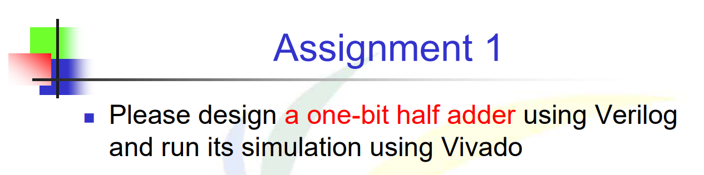

# 題目


# 解法與程式碼說明
- input 為 A 和 B ，並且輸出為 SUM 跟 CARRY ，有四種可能:

|  A  |  B  | SUM | CARRY |
| :-: | :-: | :-: | :---: |
|  0  |  0  |  0  |   0   |
|  0  |  1  |  1  |   0   |
|  1  |  0  |  1  |   0   |
|  1  |  1  |  0  |   1   |


則可透過規律可知，當A XOR B = SUM的結果，A AND B = CARRY的結果

```Verilog
module eq1
(
    input wire A, B, // 設定當前module 的 input
    output wire SUM,CARRY// 設定當前module 的 output
);
    assign SUM = A ^ B; // A XOR B 
    assign CARRY = A & B; // A AND B
endmodule
```

# TestBench測試
將TestBench接eq1的input接口，並接收output訊號

```Verilog
`timescale 1 ns/10 ps // simulation time unit/timestep
module eq1_testbench;
    // signal declaration
    reg test_in0, test_in1;
    wire test_out_SUM,test_out_CARRY;
    eq1 adder (test_in0, test_in1, test_out_SUM ,test_out_CARRY);
    // test vector generator
    initial
        begin
        // test vector 0/0
        test_in0 = 1'b0;
        test_in1 = 1'b0;
        # 200; 
        // test vector 0/1
        test_in0 = 1'b0;
        test_in1 = 1'b1;
        # 200; 
        // test vector 1/0
        test_in0 = 1'b1;
        test_in1 = 1'b0;
        # 200; 
        // test vector 1/1
        test_in0 = 1'b1;
        test_in1 = 1'b1;
        # 200;
        $stop;
    end
endmodule
```