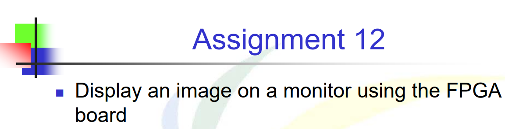
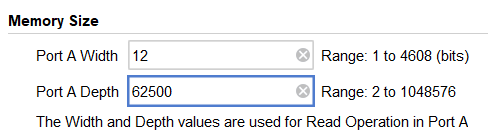

# 題目


# 解法與程式碼說明
題目挺簡單，重新畫一張新的圖片上去，所以只要對PixelGen的程式碼去做微調就好


ROM的大小要能夠放得下新圖片(.coe)，因為我的圖片是250 * 250，所以大小最少要開250 * 250=62500

程式碼的部份，就只要修改`parameter`就好:
- PosX=120
- PosY=120
- Width=圖片寬
- Height=圖片高

```Verilog
module PixelGen #(parameter PosX=120, PosY=120, Width=250, Height=250,
                                          DefaultR= 4'h0, DefaultG = 4'h0, DefaultB = 4'h0)(
		input clk,
		input reset,
		input [9:0] pixel_x,
		input [9:0] pixel_y,
		output [3:0] R,
		output [3:0] G,
        output [3:0] B
	);

	reg [3:0] r, r_next;
	reg [3:0] g, g_next;
	reg [3:0] b, b_next;

    reg [18:0]     rom_addr, rom_addr_next;
    wire [11:0]    douta;
   
	image_rom u1 (
          .clka(clk),    // input wire clka
          .addra(rom_addr),  // input wire [13 : 0] addra
          .douta(douta)  // output wire [11 : 0] douta
        );

	always@(posedge clk or negedge reset) 
	begin
		if(!reset)
		begin
			r <= DefaultR;
			g <= DefaultG;
			b <= DefaultB;
			rom_addr <= 19'b00000000000000;
		end
		else 
		begin
			r <= r_next;
			g <= g_next;
			b <= b_next;
			rom_addr <= rom_addr_next;		
		end
	end
	
	always @*
	begin
	    r_next = DefaultR;
	    g_next = DefaultG;
	    b_next = DefaultB;
	    rom_addr_next = rom_addr;
	    if (pixel_x > PosX  &&  pixel_x <= (PosX+Width) && pixel_y > PosY &&  pixel_y <= (PosY+Height))
	    begin
	       rom_addr_next = rom_addr + 19'b00000000000001;
	       r_next = douta[11:8];
	       g_next = douta[7:4];
	       b_next= douta[3:0];
	    end
	    else if (pixel_x==0 && pixel_y==0)
	    begin
	       rom_addr_next = 19'b00000000000000;
	    end
	end
	
	assign R = r;
	assign G = g;
	assign B = b;
	
endmodule

```