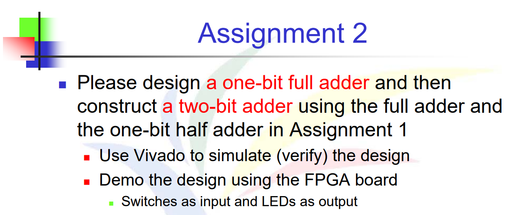
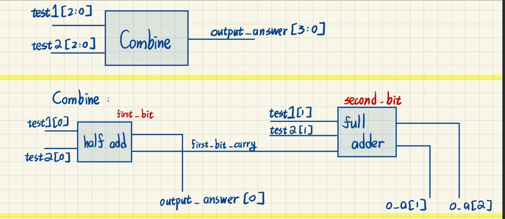
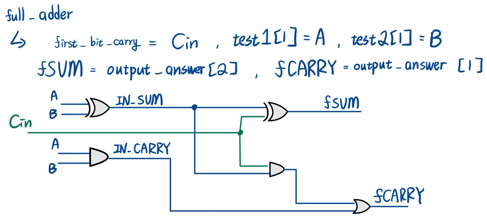
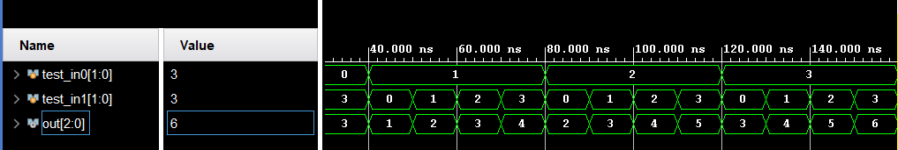

# 題目


# 解法與程式碼說明
此題與HW1連結，先設計一個新的Module(Full Adder)後，將其銜接在一起

整體架構分成三個模組：
- half_adder：處理最低位元（LSB）的加法。
- full_adder：處理次高位元，並加入來自 LSB 的進位。
- combine：將兩個模組串接起來，使前一位的進位作為下一位的輸入。

## Full Adder
| A | B | Cin | Sum | Carry (Cout) |
| - | - | --- | --- | ------------ |
| 0 | 0 | 0   | 0   | 0            |
| 0 | 0 | 1   | 1   | 0            |
| 0 | 1 | 0   | 1   | 0            |
| 0 | 1 | 1   | 0   | 1            |
| 1 | 0 | 0   | 1   | 0            |
| 1 | 0 | 1   | 0   | 1            |
| 1 | 1 | 0   | 0   | 1            |
| 1 | 1 | 1   | 1   | 1            |

```Verilog
module full_adder
    (
    input wire fA, fB,Cin,
    output wire fSUM,fCARRY
    );
    wire IN_SUM, IN_CARRY;
    assign IN_SUM = fA ^ fB; // A XOR B 
    assign IN_CARRY = fA & fB; // A AND B
    assign CARRY = IN_SUM & Cin;
    assign fSUM = IN_SUM ^ Cin;
    assign fCARRY = CARRY | IN_CARRY;
endmodule
```

## Combine
要讓兩個Module看起來好像組合一般，那就需要**後執行的Full Adder可以接收到前面Half Adder的CARRY資訊**，並將其作為自己的進位輸入（Cin），如此才能完成二位元加法。
之中，output_answer[0] - [2] 及是加法器組合答案

```Verilog

module combine(
    input wire[1:0] test1, test2,
    output wire[2:0] output_answer
    );
    
    wire first_bit_sum, first_bit_carry;
    
    half_adder first_bit(
        .hA(test1[0]),
        .hB(test2[0]),
        .hSUM(output_answer[0]),
        .hCARRY(first_bit_carry)
    );
    
    full_adder second_bit(
        .fA(test1[1]),
        .fB(test2[1]),
        .Cin(first_bit_carry),
        .fSUM(output_answer[1]),
        .fCARRY(output_answer[2])
    );
    
endmodule

```
# XDC檔案
此題需要在FPGA Board去做模擬，並且透過Switches當作input，LED當作輸出顯示2進治結果

所以宣告R1、N4、M4、R2當作我的輸入，K3、M1、L1當作輸出顯示
```
set_property PACKAGE_PIN R1 [get_ports {test1[0]}]
set_property PACKAGE_PIN N4 [get_ports {test1[1]}]
set_property PACKAGE_PIN M4 [get_ports {test2[0]}]
set_property PACKAGE_PIN R2 [get_ports {test2[1]}]
set_property PACKAGE_PIN K3 [get_ports {output_answer[0]}]
set_property PACKAGE_PIN M1 [get_ports {output_answer[1]}]
set_property PACKAGE_PIN L1 [get_ports {output_answer[2]}]
```
# TestBench 測試
因為此題需要針對2 Bits + 2 Bits 去做模擬，所以此題需要16種模擬可能

```Verilog
// Declare test signals
    reg [1:0] test_in0, test_in1;
    wire [2:0] out;

    // Instantiate the 'combine' module
    combine uut ( 
        .test1(test_in0),
        .test2(test_in1),
        .output_answer(out)
    );

    // Initial block to apply test inputs
    initial begin
        // Initialize inputs
        test_in0 = 2'b00;test_in1 = 2'b00;
        #10 test_in0 = 2'b00; test_in1 = 2'b01; // Apply first test case
        ...(16種可能)
```

# 模擬結果

