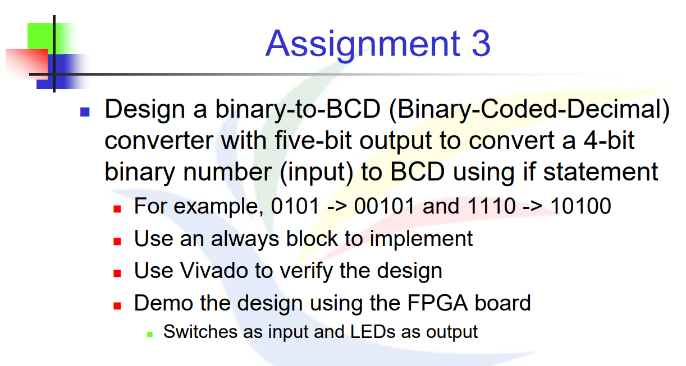

# 題目


# 解法與程式碼說明
此題只需要對input去做拆解，4 Bits 的 input 轉 5 Bits 的 output
- 若 bin_input < 10：直接輸出，bcd_output[4] = 0, bcd_output[3:0] = bin_input

- 若 bin_input ≥ 10：需要進位，bcd_output[4] = 1, bcd_output[3:0] = bin_input - 10

因為有**條件式組合邏輯（if）**，所以需要使用always block，變數就必須宣告成 reg 類型。

而此處的always block設計成*，及「當 bin_input 改變時，馬上重新計算 bcd_output。」，變數就必須宣告成 reg 類型

```Verilog
module bin_to_bcd (
    input wire [3:0] bin_input,  // 4-bit binary input
    output reg [4:0] bcd_output  // 5-bit BCD output
);
reg [3:0] bin_temp;  
always @* begin
    bcd_output = 5'b00000;
    bin_temp = bin_input;
    
    if (bin_temp >= 4'b1010) begin  
        bcd_output[4] = 1'b1;          // 設置 BCD 的高位
        bin_temp = bin_temp - 4'b1010; // 減去 10（即 4'b1010）
    end
    
    bcd_output[3:0] = bin_temp[3:0]; 
end
endmodule
```

# XDC
和HW2相近，但因為output需要 5 Bits ， 所以需要多宣告兩顆LED燈當輸出，input 名稱是 bin_input[3:0]，output 是 bcd_output[4:0]