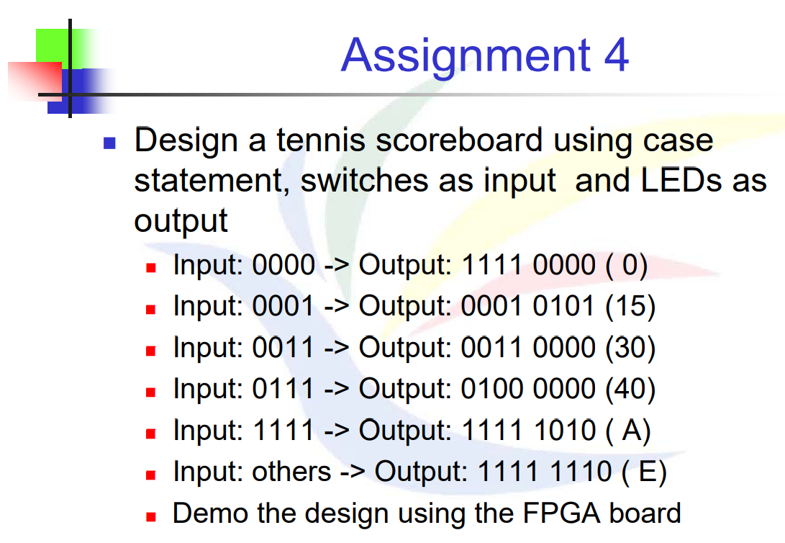

# 題目


# 解法與程式碼說明
此題也是判斷式，但此題目已知條件只有6種可能，所以可以使用switch-case去做判斷

> switch-case 是平行判斷的結構，沒有預設的優先權，也更貼近硬體設計中**多工器（multiplexer, MUX）**的運作方式，有助於**維持 RTL 的清晰邏輯**，也較容易合成出高效、面積較小的邏輯電路。

則輸入 4 Bits ，輸出 8 Bits，之中用always block去實現判斷式

```Verilog
`timescale 1ns / 1ps

module tennis(
    input wire [3:0] tennis_input,  // 4-bit input
    output reg [7:0] tennis_output  // 8-bit output
);
always @* begin
    tennis_output = 8'b11111110; //初始化
    case(tennis_input)
        4'b0000: tennis_output = 8'b11110000;
        4'b0001: tennis_output = 8'b00010101;
        4'b0011: tennis_output = 8'b00110000;
        4'b0111: tennis_output = 8'b01000000;
        4'b1111: tennis_output = 8'b11111010;
    endcase
end
endmodule

```