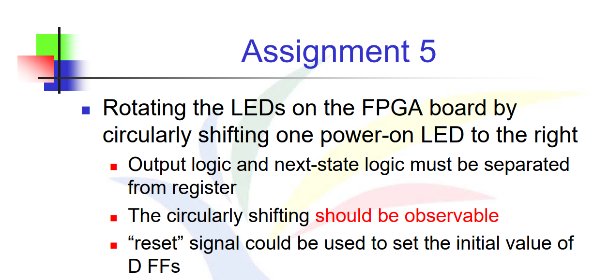

# 題目


# 解法與程式碼說明
因為Rotate的判斷需要 
- 1.查看記憶空間的值 
- 2.對值判斷做{r_current[0], r_current[7:1]}

所以我們可以將1.的記憶元件更新使用 non-blocking 去做，將r_current <= r_next ， 新的值透過 `<=` 去更新，做到FF更新同步。之中如果收到的訊息是reset，也需要對其做 r_current <= 8'b10000000 設定其預設值以滿足題目條件。

r_next = {r_current[0], r_current[7:1]} 放在 always @* 的組合邏輯區塊中，使用 blocking 賦值 `=`。

```Verilog
module rotate (
    input wire slower_clk,        
    input wire rotate_reset,      
    output wire [7:0] rotate_data  
);
    reg [7:0] r_current;
    reg [7:0] r_next;
    
    initial begin
        r_current = 8'b10000000;  // 設置初始值
    end
    
    always @(posedge slower_clk or posedge rotate_reset) begin //Register slower_clk 上升緣時觸發 (時序邏輯)
        if (rotate_reset) 
            r_current <= 8'b10000000; //重設時，將 r_current 設為預設值
        else
            r_current <= r_next; //將 r_next 的值存入 r_current 中
    end

    always @* begin // next-state logic : 更新 r_next 的值
        r_next = {r_current[0], r_current[7:1]};
    end
    
    assign rotate_data = r_current; //輸出邏輯 : module輸出的值即是r_current的值
endmodule
```

而因為原先的CLK太快(100 MHz)，所以需要一個module去放慢驅動always @(posedge)的頻率。

```Verilog
module slower_clock 
#(
    parameter N = 25,
    parameter M = 25000000  
)
(
    input wire clk,
    input wire reset,
    output wire slower_clk
);

    reg [N-1:0] r_reg;
    reg [N-1:0] r_next;
    reg clock;
    reg clock_next;

    always @(posedge clk or posedge reset) begin
        if (reset) begin
            r_reg <= 0;     
            clock <= 0;
        end else begin
            r_reg <= r_next;
            clock <= clock_next;
        end
    end

    // Next-state logic
    always @* begin
        if (r_reg == M - 1) begin
            r_next = 0;
            clock_next = ~clock;
        end else begin
            r_next = r_reg + 1;
            clock_next = clock;
        end
    end

    // Output logic
    assign slower_clk = clock;

endmodule

```

這邊也用到next-state logic，因為需要紀錄當前計算到哪裡，該模組透過計數器 r_reg 對輸入時鐘做除頻，當達到參數化的常數 M 時反轉 clock，作為較慢的 slower_clk 輸出，進而驅動 rotate.v。

最終在 combine.v 中，我們將這兩個模組整合起來，設計如下流程：

1.先由 slower_clock 模組根據原始 clk 計算並輸出 slower_clk

2.再將該 slower_clk 作為 rotate.v 的輸入時脈，觸發 always @(posedge slower_clk) 區塊

此方式確保 rotate 的狀態變化符合預期節奏，並遵守同步時序設計原則