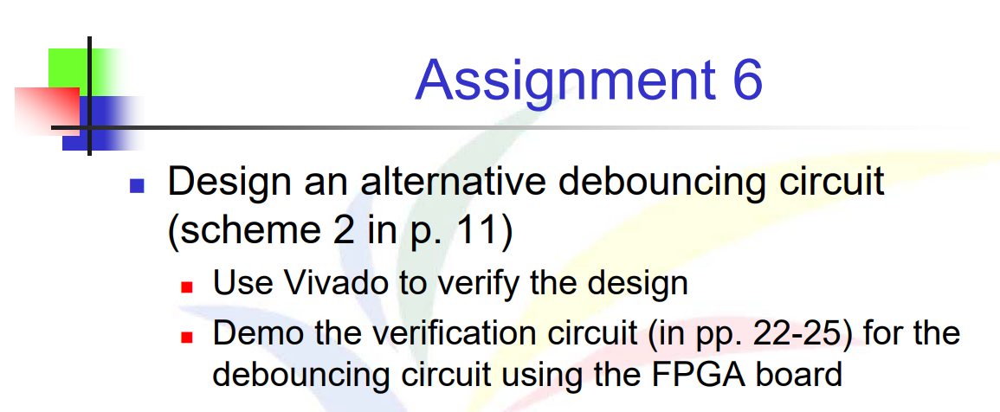
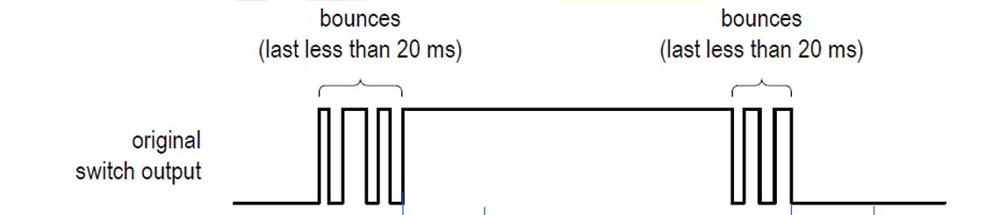
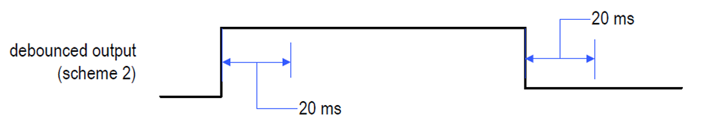
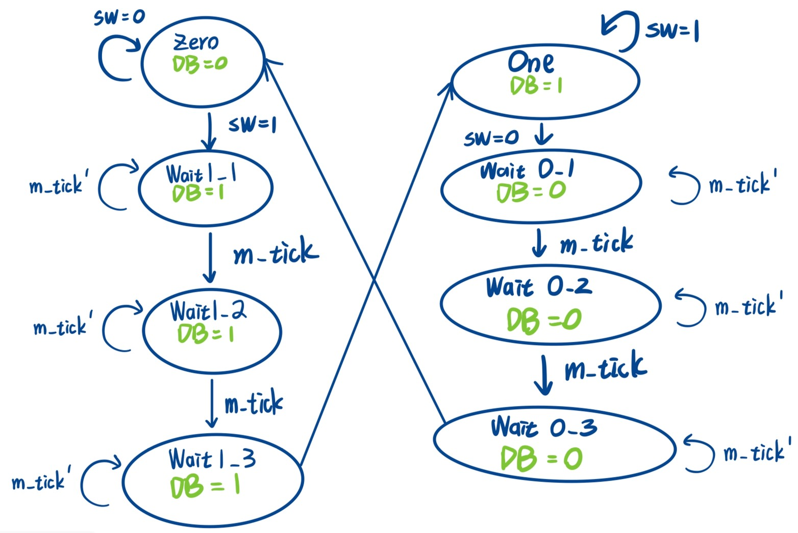
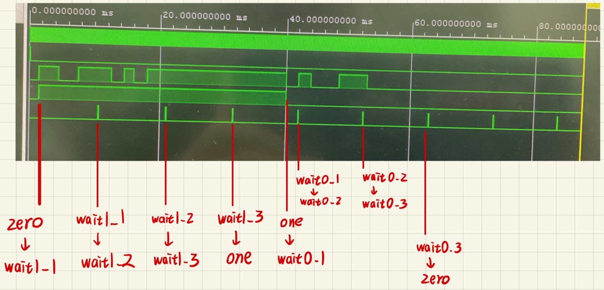

# 題目




# 解法與程式碼說明
此次作業難點在於，教授有給一個專門生成m_tick的module(約莫每10ms會生成一個tick)，程式需要與此對接，並且繪製專們的FSM。

## FSM

如果要完成第二種debounce，其實只需要做幾件事情 : 
- 1.在zero/one這兩個state下，聽`SW`是否有變化，一有變化就轉state 
- 2.當離開zero/one時，就數三次m_tick，**在數的期間無論`SW`是否有變化，都忽略**

那這邊我的設計是:
- 1.當zero/one下，聽到`SW`變化，就馬上進到 wait state中
- 2.並且下面Wait state都只聽 `m_tick` = True 的資訊，如果 True 就轉到下一個 state 中。並且會設計三個 wait state 是因為要聽到三次`m_tick`才會轉到one/zero中
- 3. zero、wait0_1、wait0_2、wait0_3 output 都輸出 0
- 4. one、wait1_1、wait1_2、wait1_3 output 都輸出 1

```Verilog
// State register
always @(posedge clk, posedge reset) begin
    if (reset)
        state_reg <= zero;
    else
        state_reg <= state_next;
end
// Next-state logic
always @* begin
    state_next = state_reg;  // Default: stay
    case (state_reg)
        zero:
            if (sw==1) state_next = wait1_1;
        wait1_1:
            if (m_tick) state_next = wait1_2;
        wait1_2:
            if (m_tick) state_next = wait1_3;
        wait1_3:
            if (m_tick) begin
                if (sw==1)
                    state_next = one;
                else
                    state_next = zero;
            end
        one:
            if (sw==0) state_next = wait0_1;
        wait0_1:
            if (m_tick) state_next = wait0_2;
        wait0_2:
            if (m_tick) state_next = wait0_3;
        wait0_3:
            if (m_tick) begin
                if (sw==0)
                    state_next = zero;
                else
                    state_next = one;
            end

        default:
            state_next = zero;
    endcase
end

// Output tick
assign dbg_tick = m_tick;
// Output logic
always @* begin
    case (state_reg)
        zero, wait0_1, wait0_2, wait0_3:
            db = 1'b0;
        one, wait1_1, wait1_2, wait1_3:
            db = 1'b1;
        default:
            db = 1'b0;
    endcase
end
```

## TestBench測試

