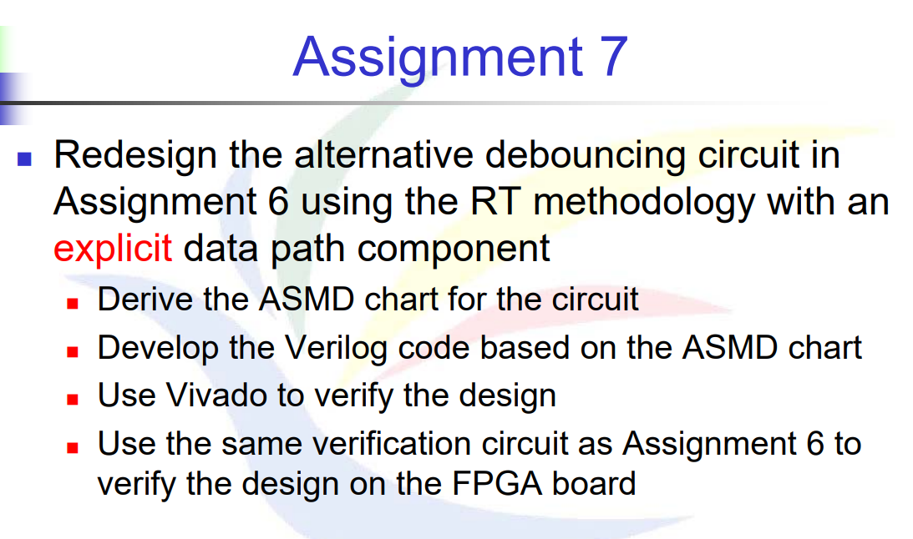
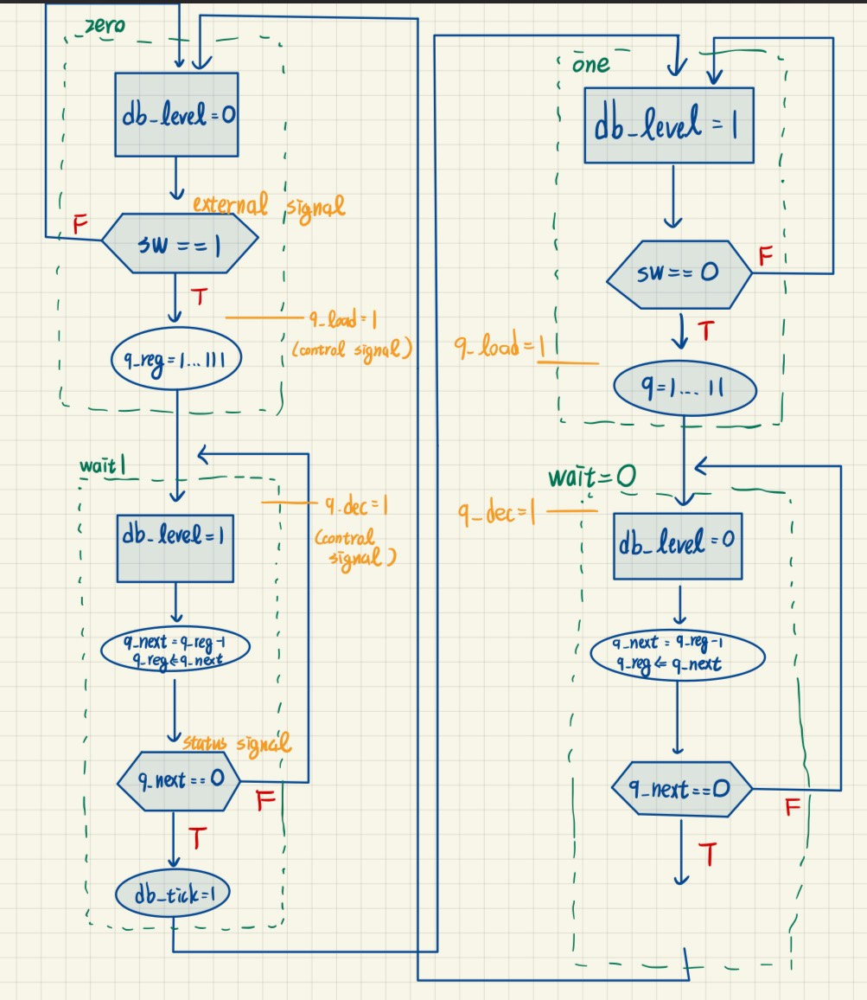

# 題目

題目跟HW6一樣，但現在要利用Data去倒數計時，並透過Data去轉換FSM狀態

# 解法與程式碼說明

## FSMD 中的 Control path


- Zero : 當接收到`SW==1`，則進到下一步使`q_reg` = 11....1，並且進入到下一個state中。
- Wait1 : 等待`q_reg`倒數完，如果倒數完，就轉到下一個state中
- One : 當接收到`SW==0`，則進到下一步使`q_reg` = 11....1，並且進入到下一個state中。
- Wait0 : 等待`q_reg`倒數完，如果倒數完，就轉到下一個state中
- 之中會安插Control Signal，目的是要打信號給外面的Data Path知道Control path進行到哪
- 在Data Path中，也會打Status Signal 告訴 Control Path 狀態


| 路徑類型             | 功能               | 相關元件                                                    |
| ---------------- | ---------------- | ------------------------------------------------------- |
| **Data Path**    | 執行計數任務與內部儲存      | `q_reg`, `q_next`, `q_zero`                             |
| **Control Path** | 控制資料行為與 FSM 狀態轉換 | `state_reg`, `state_next`, `q_load`, `q_dec`, `db_tick` |

```Verilog
module debounce_explicit
   (
    input wire clk, reset,
    input wire sw,
    output reg db_level, db_tick
   );
   localparam  [1:0]                                                
               zero  = 2'b00,
               wait0 = 2'b01,
               one   = 2'b10,
               wait1 = 2'b11;

   // number of counter bits (2^N * 20ns = 40ms)
   localparam N=21;
   reg [1:0] state_reg, state_next;
   reg [N-1:0] q_reg;
   wire [N-1:0] q_next;
   wire q_zero;
   reg q_load, q_dec;
   // fsmd state & data registers
    always @(posedge clk, posedge reset)
       if (reset)
          begin
             state_reg <= zero;
             q_reg <= 0;
          end
       else
          begin
             state_reg <= state_next;
             q_reg <= q_next;
          end
   // FSMD Data Path
   assign q_next = (q_load) ? {N{1'b1}} :   // load 1..1
                   (q_dec)  ? q_reg - 1 :   // decrement
                              q_reg;
   assign q_zero = (q_next==0);    // status signal (D->C)

   // FSMD Control Path next-state logic
   always @*
   begin
      state_next = state_reg;  // default : same
      q_load = 1'b0;    //(C->D) 預設值      
      q_dec = 1'b0;     //(C->D) 預設值  
      db_tick = 1'b0;   //(C->D) 預設值  
      case (state_reg)
         zero:
            begin
               db_level = 1'b0;
               if (sw)
                  begin
                     q_load = 1'b1; //control signal (C->D)
                     state_next = wait1;
                  end
            end
         wait1:
            begin
               db_level = 1'b1; 
               q_dec = 1'b1; //control signal (C->D)
               if (q_zero)//status signal (D->C)
                  begin
                     state_next = one;
                     db_tick = 1'b1; //control signal(C->D)
                  end
            end
         one:
            begin
               db_level = 1'b1;
               if (~sw)
                  begin
                     state_next = wait0;
                     q_load = 1'b1;
                  end
            end
          wait0:
            begin
               db_level = 1'b0;
               q_dec = 1'b1;
               if (q_zero) begin
                  state_next = zero;
               end
            end

         default: state_next = zero;
      endcase
   end

endmodule
```
