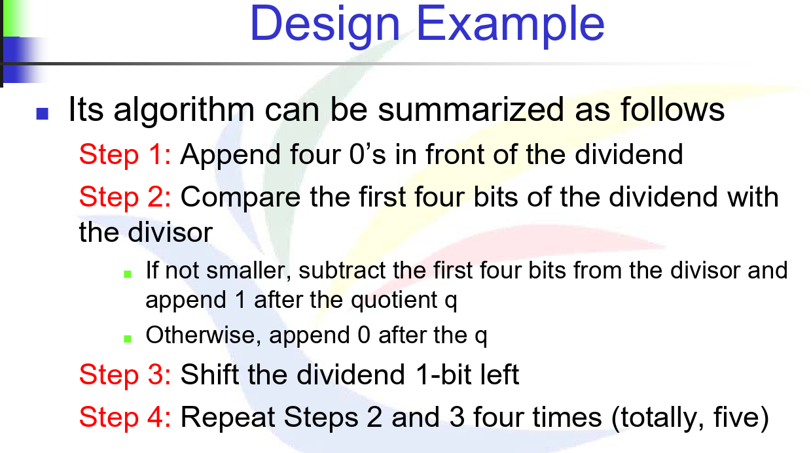
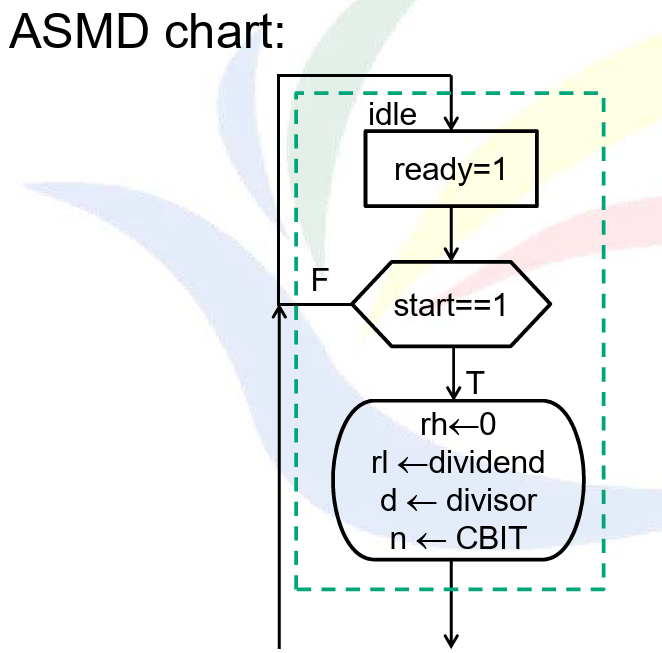
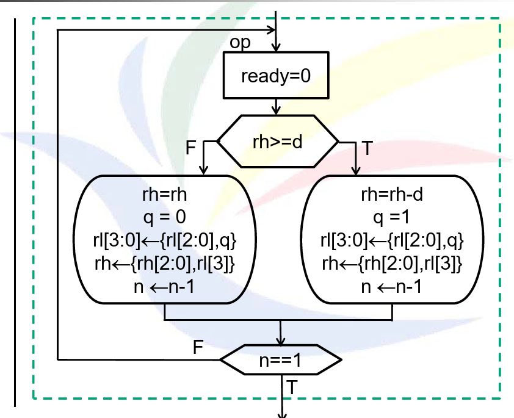
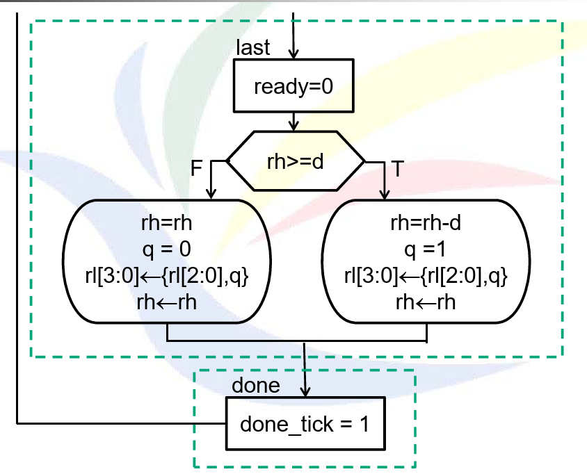
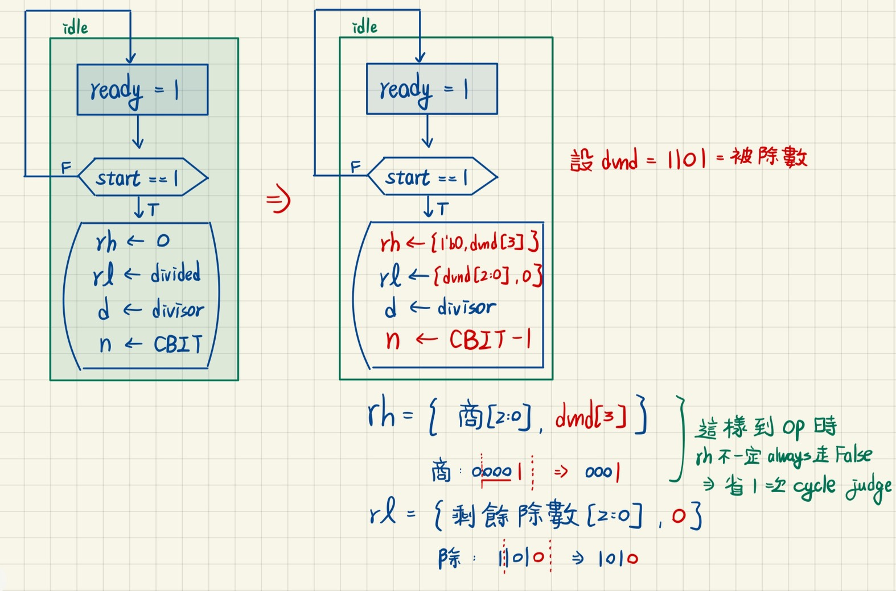

# 題目





在這樣的題目要求下，根據ASMD，哪裡會導致無效的計算，導致計算時脈變多 ? 如果有，請修改ASMD，並且重新更改程式碼。

# 解法與程式碼說明
問題在於**idle -> op**之間會有無效計算，因為第一時間的 op 判斷**永遠都會往左走( 0 / any = 0)**，所以我們可以對一開始的 rh 塞入初始值，而非預設0



所以整個題目只需要對原先程式碼中標註為 idle 的 state 去修正就好。

## 原先 idle state 程式碼

```Verilog
case (state_reg)
  idle: begin
    ready = 1'b1; 
    if (start) begin
      rh_next     = 0;     
      rl_next     = dvnd;   
      d_next      = dvsr; 
      n_next      = CBIT;  
      state_next  = op;  
    end
  end
```

## 修正後的 idle state 程式碼

```Verilog
idle: begin
            ready = 1'b1;
            if (start) begin
                rh_next = { {(W-1){1'b0}}, dvnd[W-1] }; 
                rl_next = {dvnd[W-2:0], 1'b0};  
                d_next = dvsr;   
                n_next = CBIT - 1;   
                state_next = op;
            end
        end
```

