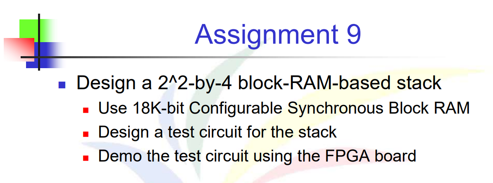
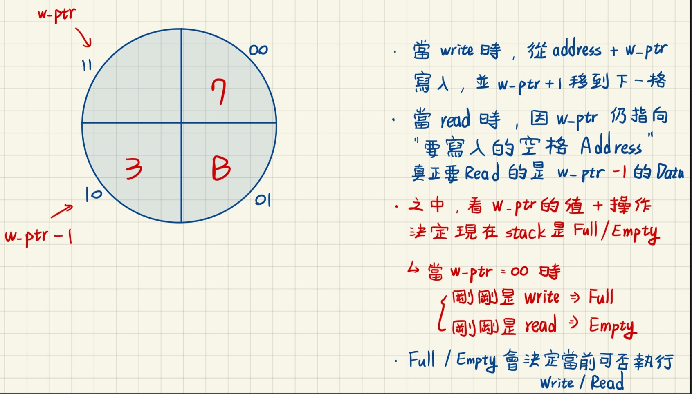

# 題目


# 解法與程式碼說明
這次的題目相比於其他作業難度不是一個檔次，這次挺複雜的。


## 程式碼分段說明
```Verilog
   // assign address
	assign address_read = {{(14-E-W){1'b0}}, (w_ptr_reg == 0 ? {W{1'b1}} : w_ptr_reg - 1), {E{1'b0}}};
	assign address_write = {{(14-E-W){1'b0}}, w_ptr_reg, {E{1'b0}}}; 
   // assign output data  
	assign r_data = (wr_en && rd_en) ? w_data : r_data16[B-1:0]; //繞過RAM，直接輸出輸入值
   // write enabled only when FIFO is not full
```

因為題目要求只能一個pointer，所以我這邊是用w_ptr，寫入的時候是看w_ptr，但閱讀的時候是看**w_ptr-1**，那如果現在read跟write同時驅動的話，就不做儲存，繞過RAM的操作，直接輸出輸入的值就好。

```Verilog
   assign wr_en = wr & ~full_reg;
	// read enabled only when FIFO is not empty
   assign rd_en = rd & ~empty_reg;
   // fifo control logic
   // register for read and write pointers
   always @(posedge clk, posedge reset)
      if (reset)
         begin
            w_ptr_reg <= 0;
            r_ptr_reg <= 0;
            full_reg <= 1'b0;
            empty_reg <= 1'b1;
         end
      else
         begin
            w_ptr_reg <= w_ptr_next;
            r_ptr_reg <= r_ptr_next;
            full_reg <= full_next;
            empty_reg <= empty_next;
         end
```
這邊的話是要判斷當前是full還是empty
- 如果是FULL，那`wr_en`就不會是True，就可以避免寫入導致的溢出。
- 如果是EMPTY，那`rd_en`就不會是True，就可以避免讀取NULL。


```Verilog
// next-state logic for read and write pointers
   always @*
   begin
      // default: keep old values
      w_ptr_next = w_ptr_reg;
      r_ptr_next = r_ptr_reg;
      full_next = full_reg;
      empty_next = empty_reg;
      case ({wr, rd})
         // 2'b00:  no op
         2'b01: // read
            if (~empty_reg) // not empty
               begin
                  w_ptr_next = w_ptr_reg - 1;
                  full_next = 1'b0;
                  if (w_ptr_next == 0)
                     empty_next = 1'b1;
               end
         2'b10: // write
            if (~full_reg) // not full
               begin
                  w_ptr_next = w_ptr_reg + 1;
                  empty_next = 1'b0;
                  if ( w_ptr_next == 0 ) // if繞了一圈
                     full_next = 1'b1;
               end
      endcase
   end

   // output logic
   assign full = full_reg;
   assign empty = empty_reg;
```

- 如果是READ，那就讓下次的 w_ptr 做 - 1，並且因為上面的read是看w_ptr - 1，所以不會有讀取來不及的問題，這邊的 -1 就是讓它自然的往下跑以模擬pop的效果
- 如果是WRITE，那就讓下次的 w_ptr 做 + 1