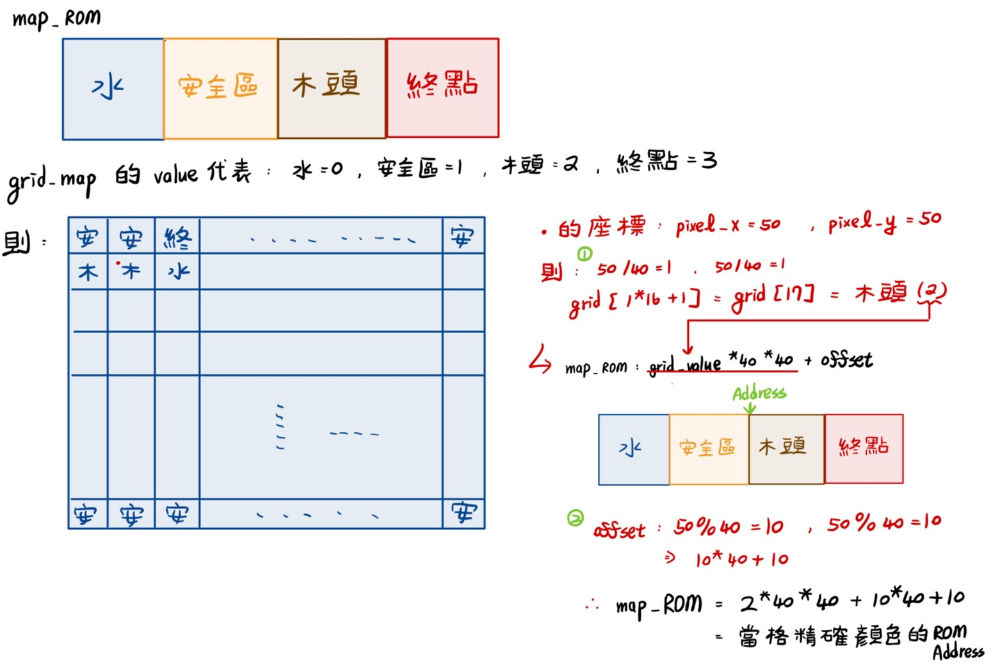
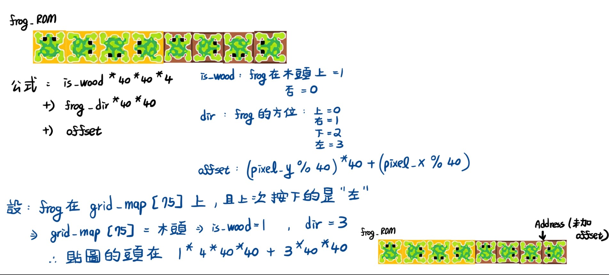

# VGA Frog Game 專案說明

## 模組架構說明

### VGASync.v
- **功能**：負責產生 VGA 同步訊號
- **輸出**：
  - `vsync`：垂直同步訊號
  - `hsync`：水平同步訊號
  - `pixel_x`、`pixel_y`：當前像素座標
- **用途**：供其他模組判斷物件位置和顯示控制

### vga_controller_brain.v
- **功能**：主控制模組
- **職責**：
  - 整合地圖邏輯
  - 控制青蛙移動邏輯
  - 管理像素顯示控制
  - 控制整體遊戲邏輯與畫面變化

### frog_logic.v
- **功能**：青蛙移動邏輯控制
- **核心功能**：
  - **邊界判斷**：防止青蛙移動超出地圖範圍
  - **落水判定**：檢測青蛙是否落入水中，若是則回到起點
  - **合法移動**：根據輸入方向更新青蛙位置與對應貼圖

### db_fsm_debounce.v
- **功能**：按鈕去彈跳處理
- **目的**：避免單次按鈕按下被誤判為多次輸入，按鈕會用於操控青蛙的上下左右移動

### pixel_generate_display.v
- **功能**：像素顯示生成
- **職責**：
  - 根據 `vga_controller_brain.v` 提供的位置資訊顯示對應圖像
  - 從 ROM 中擷取對應貼圖顏色資料
  - 將邏輯座標轉換為實際像素顯示


## 地圖是如何顯示的

### 畫面切割邏輯
遊戲畫面採用格子系統設計：
- **總畫面尺寸**：640×480 像素
- **格子尺寸**：40×40 像素
- **格子數量**：16 欄 × 12 列 = 192 格
- **index計算公式**：display_grid_index = (pixel_y / 40) * 16 + (pixel_x / 40)
- **顯示資訊**: display_grid_value = game_grid[display_grid_index];


```verilog
reg [2:0] game_grid [0:191];        // 當前地圖狀態
reg [2:0] next_game_grid [0:191];   // 下一次更新後的地圖狀態
wire [7:0] display_grid_index = grid_x + grid_y * 16;
wire [2:0] display_grid_value = game_grid[display_grid_index];
```
### 地圖元素定義

| 數值 | 元素類型 | 說明 |
|------|----------|------|
| 0 | 水 | 青蛙落入會回到起點 |
| 1 | 一般地板 | 安全區域 |
| 2 | 木頭 | 可站立的漂浮平台 |
| 3 | 終點 | 遊戲目標位置 |

## 地圖更新邏輯

### Initial
當初始化時，對地圖固定區域生成安全區與終點，並且中間河了夾雜(假)隨機生成木頭
```verilog
always @(posedge VGA_clk or negedge RESET) begin
    if (!RESET) begin
        // 預設所有格子為河流
        for (i = 0; i < 192; i = i + 1)
            game_grid[i] <= 3'b000;
        
        // 最上排設為地板
        for (i = 0; i < 16; i = i + 1)
            game_grid[i] <= 3'b001;
        
        // 中間區域放置木頭（第1-10行）
        for (i = 16; i < 105; i = i + 9) begin
            if (i + 2 < 176) begin
                game_grid[i]   <= 3'b010;
                game_grid[i+1] <= 3'b010;
                game_grid[i+2] <= 3'b010;
            end
        end
        
        for (i = 105; i < 176; i = i + 7) begin
            game_grid[i]   <= 3'b010;
            game_grid[i+1] <= 3'b010;
            game_grid[i+2] <= 3'b010;
        end
        
        // 最底排設為地板
        for (i = 176; i < 192; i = i + 1)
            game_grid[i] <= 3'b001;
        
        // 設置終點
        game_grid[6] <= 3'b011;
    end else begin
        // 更新地圖狀態
        for (i = 0; i < 192; i = i + 1)
            game_grid[i] <= next_game_grid[i];
    end
end
```

### 移動邏輯
而因為一般的青蛙過河遊戲，包含"河流的木頭會漂流"這個設定，所以每隔一段時間，河流中的木頭會移動，而移動的方法:
> 當前ROW是奇數，那就往右shift一格
> 
> 當前ROW是偶數，那就往左shift一格

```Verilog
// ===== 目的 : 拉長木頭飄動的更新時間(放慢時脈) =========
always @(posedge VGA_clk or negedge RESET) begin
    if (!RESET) begin
        tick_counter <= 0;
        update_grid_reg <= 0;
    end else if (tick_counter >= 27'd32_000_000) begin
        tick_counter <= 0;
        update_grid_reg <= 1;
    end else begin
        tick_counter <= tick_counter + 1;
        update_grid_reg <= 0;
    end
end
// ===== 目的 : 拉長木頭飄動的更新時間(放慢時脈) =========

// ===== 目的 : 判斷木頭標動的邏輯 =========
integer i, row_idx, base;
reg [2:0] temp;
always @(*) begin
    // 預設不變
    for (i = 0; i < 192; i = i + 1) begin
        next_game_grid[i] = game_grid[i];
    end

    if (update_grid) begin
        for (row_idx = 1; row_idx <= 10; row_idx = row_idx + 1) begin // 地圖只有 Y = 1 - 10之間才需要判斷移動
            base = row_idx * 16; // 一個row會有16個個子，所以16為一組去判斷
            if (row_idx % 2 == 0) begin // 偶數行向左移動
                temp = game_grid[base]; // 記住最左邊的值
                for (i = 0; i < 15; i = i + 1)
                    next_game_grid[base + i] = game_grid[base + i + 1]; // 所有當前組別格子都往index-1的方向移動
                next_game_grid[base + 15] = temp; // 最左邊的值放到最右邊
            end else begin // 奇數行向右移動
                temp = game_grid[base + 15];// 記住最右邊的值
                for (i = 15; i > 0; i = i - 1)
                    next_game_grid[base + i] = game_grid[base + i - 1]; // 所有當前組別格子都往index-1的方向移動
                next_game_grid[base] = temp;// 最右左邊的值放到最左邊
            end
        end
    end
end
// ===== 目的 : 判斷木頭標動的邏輯 =========
```

## 青蛙邏輯

### 當使用者按下按鈕後
利用`frog_x`，`frog_y`去記錄青蛙的座標(對照`grid_map`)，並且當使用者按下按鈕後，就會進行:
- 第一階段 : 移動，根據按鈕性值，更新青蛙座標並且更新青蛙的方位(例如按下左按鈕，青蛙的X座標-1，並且青蛙朝向左側)。
```Verilog
IDLE: begin // 代表玩家都還沒動作，可以隨時監聽玩家是否按下移動按鈕
                if (up && frog_y > 0) begin // 往上走
                    next_frog_y = frog_y - 1;
                    next_frog_dir = 3'b000;
                    next_state = DROWN_CHECK;
                end else if (down && frog_y < 11) begin// 往下走
                    next_frog_y = frog_y + 1;
                    next_frog_dir = 3'b010;
                    next_state = DROWN_CHECK;
                end else if (left && frog_x > 0) begin// 往左走
                    next_frog_x = frog_x - 1;
                    next_frog_dir = 3'b011;
                    next_state = DROWN_CHECK;
                end else if (right && frog_x < 15) begin// 往右走
                    next_frog_x = frog_x + 1;
                    next_frog_dir = 3'b001;
                    next_state = DROWN_CHECK;
                end 
                else if (update_grid) begin // 當此訊號tick，代表當前木頭正在移動，木頭移動時也需要更新青蛙位置，判斷方式跟木頭飄移一樣
                    if (frog_y > 0 && frog_y < 11 && current_grid_value == 3'b010) begin
                        if (frog_y % 2 == 0) begin
                            next_frog_x = (frog_x > 0) ? frog_x - 1 : 0;
                        end else begin
                            next_frog_x = (frog_x < 15) ? frog_x + 1 : 15;
                        end
                    end
                    if (frog_y > 0 && frog_y < 11) begin
                        next_state = DROWN_CHECK;
                    end
                end
            end
```
- 第二階段 : 當移動完成後，判斷是否落水(當前frog的座標對照`grid_map`是否是水)， 如果是，那就回到初始起點，否則沒事

```Verilog
DROWN_CHECK: begin //會需要獨立分出 DROWN_CHECK，是為了讓地圖更新能更新到新的值
            // 第一時間 : 當update_grid tick時，地圖的值跟青蛙的座標都會有變化，所以需要先更新完之後，才能對其進行判斷青蛙的座標是否是木頭
            // 第二時間 : 現在青蛙的FSM是 DROWN_CHECK ，對當前地圖去查詢是否當前座標是木頭
                if (frog_y > 0 && frog_y < 11 && current_grid_value == 3'b000) begin // 如果是水
                    next_frog_x = 4'd11; // 初始化青蛙的座標，回到安全區
                    next_frog_y = 4'd11;
                    next_frog_dir = 3'b000;
                end
                next_state = IDLE;
            end

```

### 當地圖更新(update_grid tick，即當前河流上的木頭飄動)
當地圖更新的時候，根據青蛙的ROW決定他會如何移動，跟木頭一樣的移動邏輯

```Verilog
else if (update_grid) begin // 當此訊號tick，代表當前木頭正在移動，木頭移動時也需要更新青蛙位置，判斷方式跟木頭飄移一樣
                    if (frog_y > 0 && frog_y < 11 && current_grid_value == 3'b010) begin
                        if (frog_y % 2 == 0) begin
                            next_frog_x = (frog_x > 0) ? frog_x - 1 : 0;
                        end else begin
                            next_frog_x = (frog_x < 15) ? frog_x + 1 : 15;
                        end
                    end
                    if (frog_y > 0 && frog_y < 11) begin
                        next_state = DROWN_CHECK;
                    end
                end
```

### 為何要分移動跟Drown Test兩階段執行?
因為當地圖更新的時候，青蛙的座標跟"地圖上的木頭"座標都會變，如果不分兩階段執行，很可能出現Race Condition，即判斷青蛙是否落水的地圖參照，很可能出現"舊青蛙對照新地圖"或是"新青蛙對照舊地圖"的問題，所以我提出的方法如下:


## 顯示畫面到螢幕上(`pixel_generate_display.v`)
最終畫面上的顯示計算邏輯是在此模組中完成。為了讓顯示對應 .coe 圖片檔的每一個像素，我將整個畫面切割成 40 × 40 的格子（Grid），這樣做的理由如下：

### 分割成 40 × 40 格子的原因：
除了上述提到的方便找出目前顯示的格子類型（grid_value）外，也可以透過`%`去找到offset，此office可以幫助我們找到精確的ROM Address

### 精確對應到 ROM 中圖片的位置
每種格子的圖案都儲存在 ROM 中，每個圖案固定大小為 40 × 40 像素，因此只要知道當前是**第幾個格子**，便能**計算出該圖在 ROM 中的起始位置。**

### 快速計算 ROM offset，直接對應像素色值
每個像素在當前 grid 中的相對位置（local_x, local_y）可這樣計算：
```Verilog
local_x = pixel_x % 40;
local_y = pixel_y % 40;
pixel_offset = local_y * 40 + local_x;
```

這樣就可以對應到該格圖案的第 pixel_offset 個像素，進而從 ROM 讀取正確顏色資料。

### 地圖顯示的總流程圖解：
先確定當前格子是什麼格子，先將指針指引到"ROM中當格資訊"的頭部 -> 透過 pixel 座標計算offset 找到" 頭部 + office "精確顏色pixel並且繪圖。

```Verilog
    // pixel 在格子中的位置
    wire [5:0] local_x = pixel_x % GRID_SIZE;
    wire [5:0] local_y = pixel_y % GRID_SIZE;
    wire [11:0] pixel_offset = local_y * GRID_SIZE + local_x;
    map_rom_addr = grid_value * GRID_SIZE * GRID_SIZE + pixel_offset;
```



### 青蛙也是同理，但多了四個方位的圖

公式如下 : `frog_rom_addr = is_wood * 4 * GRID_SIZE * GRID_SIZE + frog_dir * GRID_SIZE * GRID_SIZE + pixel_offset;`

因為我有設計"青蛙在安全區與木頭時的貼圖"，所以總共八張青蛙，分別是在安全區中的上下左右，以及木頭上的上下左右

